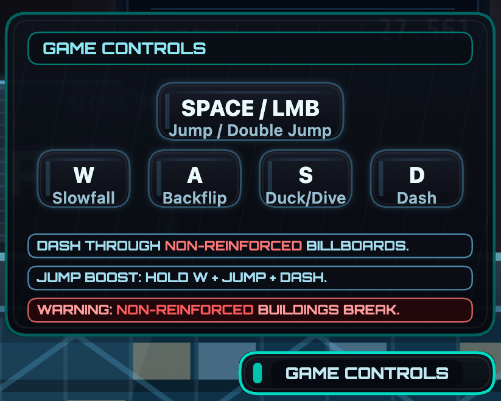

## Notes

1. [ ] After pressing spacebar to start or clicking on the start button, automatically implement Dash on Bob. and player should not be able to interact until after zoomed out.
    > Ask if unclear

2. [ ] Can you make Slowfall smoother? like glide better?
    > To discuss

3. [ ] (POTENTIAL) Smoother motion on 120 Hz screens
    > Physics runs at 60 Hz, and `main.js` only redraws after a physics step, so a 120 Hz screen shows about 60 fps.
    > Fix: pass `acc / FIXED_DT` to the renderer and blend between the previous and current positions.
    > Not measured on a 120 Hz screen yet.

4. [ ] Mix and match billboards to buildings
    > allow blue billboards on red buildings (if the building collapses, the billboard stays on the ground still standing)
    > red billboards should still work the same on blue 

5. [ ] how can we make the dive better?

## Updates implemented

1. [x] The wind effect while dashing seems jarring. like it suddenly appears. is there a way to make it look more seamless?
    > ✅ Done: the wind used to go from nothing to full on the press frame, with ~60 lines all over the screen at once. It now comes in as a gust: the lines fade in over 0.15 s and a soft front sweeps them in from the right, crossing the screen in 0.3 s. A dash while the wind is still showing carries on the same gust. Fading out is unchanged (it follows the boost). Tune with `WIND_FADE_IN_SEC`, `WIND_SWEEP_SEC` and `WIND_EDGE_FRAC` in `src/render/player/dashFx.js`.

2. [x] Can make game controls menu better?
    > 
    > Something easier to understand
    > ✅ Done: the panel now groups moves by when you use them, ON A ROOF (Space jump, hold S duck, D dash) and IN THE AIR (Space jump again, hold W slowfall, S dive, A backflip, D dash), so a key that does two things reads naturally. Holds are marked HOLD. The bottom explains the two materials in the colours the world uses: pink glass (dash through its ads, roofs crumble) and blue steel (duck or jump its ads, roofs hold). This replaces "non-reinforced", which the game never shows. On touch screens the chips show the button names. Text is 10–13 px, up from 9. Code: `src/render/hud/controls.js`.

3. [x] how to make the training section better?
    > ✅ Done: three changes.
    > - **Final test**: after the backflip lesson comes a FINAL TEST that mixes the moves (a double jump or slowfall gap, a steel ad to duck, a glass ad to dash, then a drop onto a low roof). Nothing stops and no key is shown, so the player has to choose each move. A fall or a crash sends you back to the start of the test.
    > - **EXIT and SKIP**: two buttons at the top left during training. EXIT (or Esc) glitches back to the start screen. SKIP goes to the next lesson, and skipping the test finishes training. Both work while the game is stopped for a move, and tapping them doesn't make Bob jump.
    > - **Jump freeze only before an air move**: lesson 1 still freezes for the jump, and so do the lessons where a move follows the jump (double jump, slowfall, dive, backflip). Duck and dash no longer have a jump step: their prompt shows the move straight away, and the player clears the small gap before it on their own. Ducking or dashing only counts on the lesson's goal roof, so doing it early on the runway doesn't pass the lesson.
    > Code: `src/game/tutorial.js`, `src/render/hud/training.js`, `src/game/index.js`, `src/ui/layout.js`, `src/input.js`.
